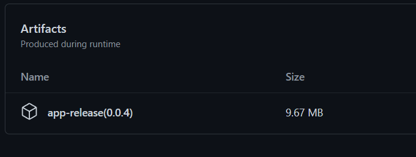

# arhiterm

## Описание
Интернет магазин фирмы Архитерм (фронтенд)

## Сборка проекта прод

На проекте настроены workflow. После мерж реквеста в ветку release 
будет запущено задание автоматической доствки на сервер

## Сборка Android app

1. Перейти во вкладку Actions  
2. Выбрать задание Build Android  
3. Кликнуть по кнопке ```Run workflow```  
4. В открывшемся меню указать версию релиза больше последнего  
   4.1. Для того чтобы посмотреть номер последнего релиза, перейдите в
   последнюю удачную сборку и найдите в конце страницы сгенерированный артефакт с приложением.
   В конце названия, в скобках, будет указан номер релиза приложения (см. рисунок 1)
5. нажать ```Run workflow```  


<p align="center">Рисунок 1 - пример артефакта</p>

## Build DEV Setup

```bash
# install dependencies
$ npm install

# serve with hot reload at localhost:3000
$ npm run dev

# build for production and launch server
$ npm run build
$ npm run start

# generate static project
$ npm run generate
```

